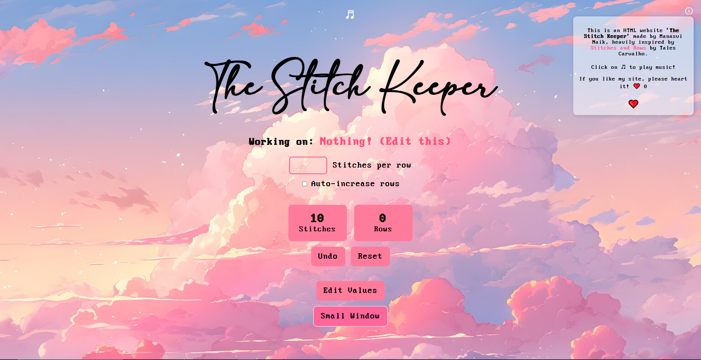
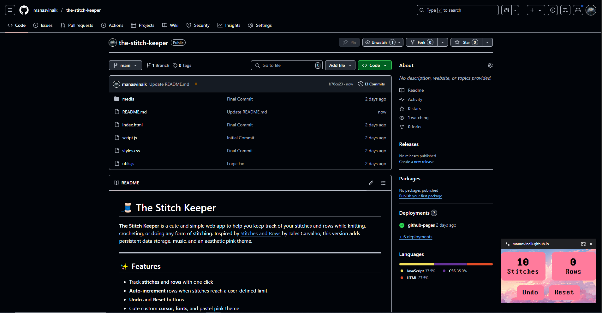

# 🧵 The Stitch Keeper

**The Stitch Keeper** is a cute and simple web app to help you keep track of your stitches and rows while knitting, crocheting, or doing any form of stitching. Inspired by [Stitches and Rows](https://github.com/Tales-Carvalho/stitches-and-rows) by Tales Carvalho, this version adds persistent data storage, music, and an aesthetic pink theme.

---

## Features

- Track **stitches** and **rows** with one click
- **Auto-increment** rows when stitches reach a user-defined limit
- **Undo** and **Reset** buttons
- Cute custom **cursor**, **fonts**, and pastel pink theme
- Background **music player** with randomized tracks
- **Mini floating window** (Picture-in-Picture) so you can track while browsing elsewhere

---

## Preview

### Main Page


### Mini Floating Counter Window


---

## Installation

### 1. Clone the repository

```bash
git clone https://github.com/yourusername/stitch-keeper.git
cd stitch-keeper

